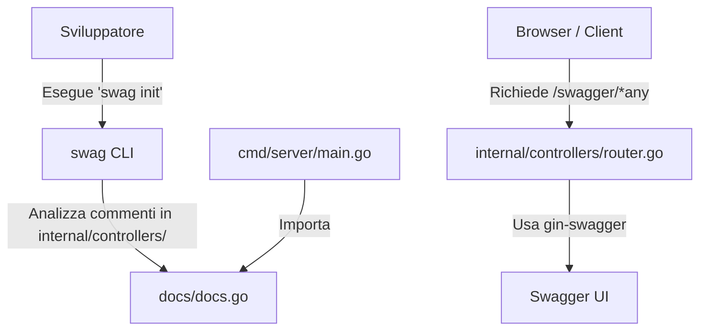

# Specifica Tecnica: Integrazione OpenAPI / Swagger UI con Swaggo

**Data:** 2026-07-15
**Stato:** In Revisione
**Autore:** Antigravity (AI)

---

## 1. Obiettivo e Motivazione

L'obiettivo di questa specifica è introdurre una documentazione API interattiva ed autogenerata per `spotiflac-rest-api` utilizzando lo standard OpenAPI (Swagger). La documentazione renderà più semplice per gli sviluppatori e i client comprendere gli endpoint disponibili, i payload accettati e le risposte fornite.

Scegliamo un approccio **Code-First con Swaggo**, in cui la specifica tecnica viene generata a partire dai commenti posizionati direttamente nel codice Go dei controller. Questa integrazione viene eseguita in parallelo al refactoring architetturale (da monolito a MVC/Multi-Layer), inserendo le annotazioni direttamente nei nuovi controller situati nella cartella `internal/controllers/`.

---

## 2. Struttura del Progetto e Flusso

La struttura del progetto con l'integrazione di Swagger sarà la seguente:

```text
spotiflac-rest-api/
├── cmd/
│   └── server/
│       └── main.go              # Entrypoint: definisce i metadati globali dell'API ed avvia il server
├── docs/                        # Cartella autogenerata da Swaggo (docs.go, swagger.json, swagger.yaml)
├── internal/
│   ├── models/                  # Modelli dati (DownloadRequest, Task, ecc.)
│   ├── repositories/            # Strato di persistenza dati
│   ├── services/                # Business logic (DownloadService)
│   └── controllers/             # Endpoint HTTP + Annotazioni Swagger
│       ├── health_controller.go 
│       ├── download_controller.go 
│       └── router.go            # Rotte Gin e middleware di Swagger
```

### Flusso dei dati e documentazione


---

## 3. Dipendenze Go

Aggiungeremo al file `go.mod` le seguenti librerie:
*   `github.com/swaggo/gin-swagger`: Middleware Gin per servire la Swagger UI.
*   `github.com/swaggo/files`: File statici necessari per la UI.
*   `github.com/swaggo/swag/cmd/swag`: Strumento CLI per generare la documentazione a tempo di build (non incluso nel binario di produzione).

---

## 4. Dettaglio delle Annotazioni e dei Controller

### 4.1. Metadati Globali (`cmd/server/main.go`)
I metadati generali dell'API verranno dichiarati sopra la funzione `main`:

```go
// @title          SpotiFLAC REST API
// @version        1.0
// @description    Un wrapper REST API leggero per il backend SpotiFLAC.
// @contact.name   Supporto API
// @host           localhost:8080
// @BasePath       /
```

### 4.2. Health Controller (`internal/controllers/health_controller.go`)
Fornisce un semplice endpoint per verificare lo stato di salute del servizio.

```go
// HealthCheck godoc
// @Summary      Health Check
// @Description  Verifica se il server API è attivo e funzionante
// @Tags         System
// @Produce      json
// @Success      200  {object}  map[string]interface{} "Esempio: {\"status\": \"ok\"}"
// @Router       /api/health [get]
```

### 4.3. Download Controller (`internal/controllers/download_controller.go`)
Gestisce i download sincroni, asincroni e il tracciamento dei task.

```go
// DownloadAsync godoc
// @Summary      Avvia download asincrono
// @Description  Invia un task di download in background e restituisce immediatamente l'ID del task per evitarne il timeout
// @Tags         Download
// @Accept       json
// @Produce      json
// @Param        request  body      models.DownloadRequest  true  "Parametri per il download"
// @Success      202      {object}  map[string]interface{} "Contiene task_id, status e message"
// @Failure      400      {object}  map[string]string      "Richiesta non valida"
// @Router       /api/download [post]

// DownloadSync godoc
// @Summary      Avvia download sincrono
// @Description  Esegue il download in modo bloccante e ritorna i file scaricati una volta terminato
// @Tags         Download
// @Accept       json
// @Produce      json
// @Param        request  body      models.DownloadRequest  true  "Parametri per il download"
// @Success      200      {object}  map[string]interface{} "Contiene lo stato completato e la lista dei file"
// @Failure      400      {object}  map[string]string      "Richiesta non valida"
// @Failure      500      {object}  map[string]string      "Errore durante il download"
// @Router       /api/download/sync [post]

// GetStatus godoc
// @Summary      Stato del task
// @Description  Restituisce lo stato corrente di un task di download asincrono tramite il suo ID
// @Tags         Download
// @Produce      json
// @Param        id   path      string  true  "ID del Task"
// @Success      200  {object}  models.Task
// @Failure      404  {object}  map[string]string "Task non trovato"
// @Router       /api/status/{id} [get]
```

---

## 5. Configurazione del Router (`internal/controllers/router.go`)

Il router di Gin registrerà il gestore di Swagger UI sull'endpoint `/swagger/*any`.

```go
package controllers

import (
	"github.com/gin-gonic/gin"
	swaggerFiles "github.com/swaggo/files"
	ginSwagger "github.com/swaggo/gin-swagger"
	
	// Import anonimo dei file generati per inizializzare Swagger
	_ "github.com/capimichi/spotiflac-rest-api/docs"
)

// SetupRouter configura le rotte dell'applicazione
func SetupRouter(healthCtrl *HealthController, downloadCtrl *DownloadController) *gin.Engine {
	r := gin.Default()

	// ... Middleware esistenti (CORS, ecc.) ...

	// Rotte API
	r.GET("/api/health", healthCtrl.HealthCheck)
	r.GET("/api/status/:id", downloadCtrl.GetStatus)
	r.POST("/api/download", downloadCtrl.DownloadAsync)
	r.POST("/api/download/sync", downloadCtrl.DownloadSync)

	// Rotta Swagger UI
	r.GET("/swagger/*any", ginSwagger.WrapHandler(swaggerFiles.Handler))

	return r
}
```

---

## 6. Piano di Integrazione e Validazione

1.  **Installazione di swag**: Installare la CLI `swag` con `go install github.com/swaggo/swag/cmd/swag@latest` o `go get`.
2.  **Scaffolding & Controllers**: Implementare il refactoring dei controller e inserire le annotazioni Swagger descritte sopra.
3.  **Generazione Docs**: Eseguire `swag init -g cmd/server/main.go -o docs/` per generare i file in `docs/`.
4.  **Middleware Setup**: Configurare il router per servire Swagger UI.
5.  **Verifica**:
    *   Avviare il server.
    *   Navigare su `http://localhost:8080/swagger/index.html` e verificare il corretto caricamento dell'interfaccia interattiva.
    *   Verificare che sia possibile testare gli endpoint direttamente dall'interfaccia.
