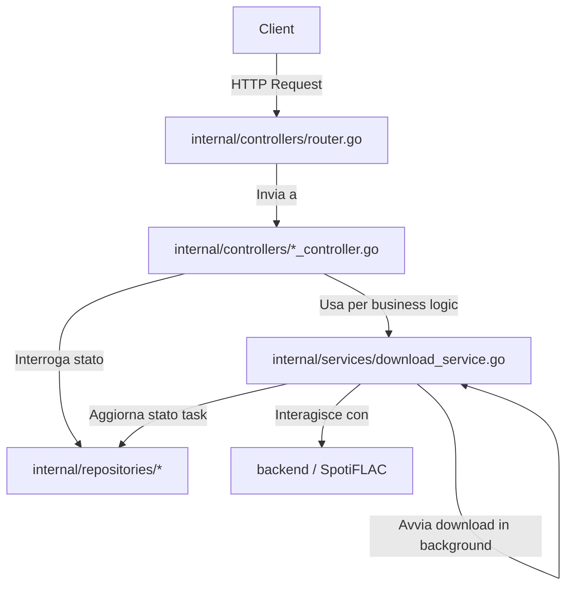

# Specifica Tecnica: Refactoring Architetturale da Monolito a MVC/Multi-Layer

**Data:** 2026-07-15
**Stato:** In Revisione
**Autore:** Antigravity (AI)

---

## 1. Obiettivo e Motivazione

L'attuale codebase di `spotiflac-rest-api` ha tutta la logica concentrata in un unico file monolitico (`main.go`). Questo approccio rende difficile la manutenzione, i test isolati ed eventuali estensioni future (come l'aggiunta di un database SQL reale o l'integrazione di un frontend).

L'obiettivo di questo refactoring è ristrutturare l'applicazione seguendo lo **Standard Go Project Layout** (introducendo le cartelle `cmd/` e `internal/`) e separando nettamente le responsabilità tramite un'architettura a tre strati:
1.  **Controllers (Handlers)**: Gestione delle richieste HTTP, validazione dei dati e risposte JSON.
2.  **Services**: Logica di business (recupero metadati Spotify, download dei file, ciclo dei task in background).
3.  **Repositories**: Persistenza dei dati (attualmente in memoria RAM, ma astraibile tramite interfacce per futuri database).

---

## 2. Architettura e Struttura Directory

Il progetto sarà riorganizzato come segue:

```text
spotiflac-rest-api/
├── cmd/
│   └── server/
│       └── main.go              # Entrypoint dell'applicazione
├── internal/
│   ├── models/                  # Modelli dati
│   │   ├── task.go              # Definizioni di Task e TaskStatus
│   │   └── request.go           # Struttura DownloadRequest
│   ├── repositories/            # Persistenza dati
│   │   ├── repository.go        # Interfaccia TaskRepository
│   │   └── memory.go            # Implementazione in-memory di TaskRepository
│   ├── services/                # Logica di business
│   │   └── download_service.go  # Core del download e worker in background
│   └── controllers/             # Endpoint HTTP e Routing
│       ├── health_controller.go # Handler per /api/health
│       ├── download_controller.go # Handlers per i download e lo status
│       └── router.go            # Configurazione router Gin e CORS
├── go.mod
├── go.sum
└── README.md
```

### Flusso dei Dati


---

## 3. Dettaglio dei Componenti

### 3.1. Models (`internal/models/`)
I modelli sono puramente definizioni di dati e non contengono logica di business.

*   `models.Task`: Rappresenta lo stato di un download, sia esso in corso, completato o fallito.
*   `models.DownloadRequest`: La struttura del payload JSON per le richieste di download.

### 3.2. Repositories (`internal/repositories/`)
Il repository gestisce l'accesso e la memorizzazione dei task. Utilizziamo un'interfaccia `TaskRepository` per garantire il disaccoppiamento:

```go
type TaskRepository interface {
    Create(spotifyURL, service, quality string) (*models.Task, error)
    Get(id string) (*models.Task, bool, error)
    Update(id string, fn func(*models.Task)) error
}
```

L'implementazione predefinita sarà `InMemoryTaskRepository` (in `internal/repositories/memory.go`), la quale userà una mappa Go protetta da un mutex (`sync.RWMutex`), identica a quella attualmente in `main.go`.

### 3.3. Services (`internal/services/`)
Il `DownloadService` è il motore dell'applicazione. Contiene tutta la logica complessa che collega i metadati Spotify con i moduli di download `backend` di SpotiFLAC (Qobuz, Tidal, Amazon).

Dipendenze:
*   Riceve una `TaskRepository` per aggiornare lo stato dei task durante le operazioni asincrone.

Metodi principali:
*   `DownloadAsync(req models.DownloadRequest) (*models.Task, error)`: Crea un task, avvia una goroutine in background per scaricare i file e ritorna immediatamente il task creato.
*   `DownloadSync(req models.DownloadRequest) ([]string, error)`: Esegue il download bloccando la goroutine principale e ritorna i percorsi dei file scaricati.

### 3.4. Controllers (`internal/controllers/`)
I controller gestiscono l'input/output HTTP. Utilizzano il framework Gin.

*   `HealthController`: Gestisce l'health check del server.
*   `DownloadController`: Gestisce l'avvio dei download (sync/async) e la lettura dello stato dei task.
*   `Router`: Definisce le rotte di Gin, la configurazione CORS e associa i controller alle rispettive rotte.

---

## 4. Gestione degli Errori e Casi Limite

1.  **Race Conditions**: Tutte le operazioni di lettura/scrittura sui task in-memory sono protette dal Mutex all'interno dell'implementazione in `memory.go`.
2.  **Timeout HTTP**: I download sincroni molto grandi possono comunque incorrere in timeout HTTP a seconda del client. Il servizio consiglia sempre l'uso della modalità asincrona per playlist o album.
3.  **Gestione degli Errori SpotiFLAC**: Gli errori derivanti dal download o dalla decodifica ffmpeg vengono catturati all'interno della goroutine asincrona e salvati nel campo `Error` del task, impostandone lo stato a `failed`.

---

## 5. Piano di Migrazione

1.  **Fase 1: Scaffolding**: Creazione della struttura delle directory ed isolamento dei modelli in `internal/models/`.
2.  **Fase 2: Creazione del Repository**: Creazione dell'interfaccia `TaskRepository` e della sua implementazione in memoria.
3.  **Fase 3: Estrazione del Servizio**: Spostamento delle funzioni di download (`executeDownload`, `downloadTask`, ecc.) in `internal/services/`.
4.  **Fase 4: Creazione dei Controllers e Router**: Spostamento dei gestori HTTP in `internal/controllers/`.
5.  **Fase 5: Sostituzione di `main.go`**: Modifica del `main.go` principale per orchestrare l'avvio dei componenti e rimozione della logica precedente.
6.  **Fase 6: Verifica**: Build e test dei vari endpoint per assicurare la retrocompatibilità totale con le API esistenti.
